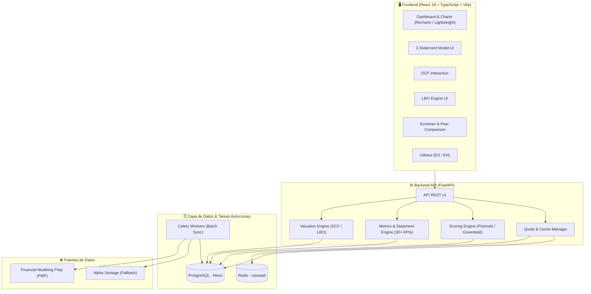

# 📊 ForgingValue — Value Investing & Financial Analysis Platform

> **ForgingValue** es una plataforma web full-stack de análisis fundamental, valoración financiera avanzada y detección de oportunidades de inversión bajo la filosofía del *Value Investing*. Integra modelos cuantitativos y financieros de grado institucional (DCF, LBO, 3-Statement Model, Piotroski F-Score y Magic Formula) en una arquitectura moderna, escalable, políglota (ES/EN) y orientada a la educación del inversor.

---

## ⚡ Características Principales (Highlights)

- **📋 3-Statement Model Enlazado:** Visualización interconectada de *Income Statement*, *Balance Sheet* y *Cash Flow Statement* con resaltado dinámico de flujos inter-estados y detección automática de *red flags* contables.
- **💰 Motor DCF Interactivo:** Valoración por Flujos de Caja Descontados con proyecciones dinámicas, cálculo de WACC vía CAPM, valor terminal (Gordon Growth) y matriz de sensibilidad bidimensional (*WACC × Growth Rate*).
- **🏦 Análisis LBO (Leveraged Buyout):** Modelo interactivo con estructura de deuda de 2 tramos (*Senior* y *Subordinated*), cascada de pagos (*cash sweep*), cálculo de retornos (IRR y MOIC) y desglose de *value drivers*.
- **📊 Scoring y Screener Cuantitativo:** Screener multi-criterio con implementación del **Piotroski F-Score (0-9)** y la **Fórmula Mágica de Greenblatt** (Earnings Yield + ROIC ranking).
- **👥 Peer Comparison:** Comparador de múltiples empresas simultáneas con gráficos normalizados y radar de salud financiera.
- **🌐 Políglota & Formateo Financiero Locale-Aware:** Soporte completo para Español e Inglés con formateo de divisas y fechas adaptado mediante la API nativa `Intl`.
- **🎓 Modo Aprendizaje & Glosario:** Tooltips explicativos en cada KPI y sección educativa con fórmulas matemáticas en LaTeX y casos prácticos.
- **⚡ Arquitectura de Alto Rendimiento:** Caché en 3 niveles (*TanStack Query → Redis → PostgreSQL*) que reduce la dependencia de APIs externas en un 95% y mantiene tiempos de respuesta `<200ms`.

---

## 🏗️ Arquitectura del Sistema



---

## 🛠️ Stack Tecnológico

| Capa | Tecnologías |
| :--- | :--- |
| **Frontend** | React 18, TypeScript, Vite, Tailwind CSS, Shadcn/UI, Recharts, TradingView Lightweight Charts, TanStack Query, react-i18next |
| **Backend** | Python 3.11+, FastAPI, SQLAlchemy 2.0 (Async), Alembic, Pydantic v2, SciPy (IRR solver), Structlog |
| **Bases de Datos & Caché** | PostgreSQL (Neon), Redis (Upstash) |
| **Tareas en Segundo Plano** | Celery con Redis broker |
| **DevOps & Despliegue** | Docker Compose, GitHub Actions (CI/CD), Vercel (Frontend), Render (Backend) |

---

## 📂 Estructura del Monorepo

```text
forgingvalue/
├── backend/                  # API REST construida con FastAPI
│   ├── app/
│   │   ├── api/v1/          # Endpoints versionados
│   │   ├── core/            # Configuración, seguridad y constantes
│   │   ├── models/          # Modelos de base de datos SQLAlchemy
│   │   ├── schemas/         # Esquemas de validación Pydantic
│   │   ├── services/        # Lógica de negocio (DCF, LBO, Scoring, Providers)
│   │   └── workers/         # Tareas asíncronas de Celery
│   ├── tests/               # Pruebas unitarias e integración (pytest)
│   └── requirements.txt     # Dependencias de Python
├── frontend/                 # Aplicación Web React + TypeScript + Vite
│   ├── public/locales/      # Traducciones i18n (es / en)
│   ├── src/
│   │   ├── components/      # Componentes UI reutilizables
│   │   ├── features/        # Módulos por dominio (dcf, lbo, statements, screener)
│   │   ├── hooks/           # Custom hooks y React Query
│   │   └── lib/             # Cliente API y utilidades de formateo
│   └── package.json         # Dependencias de Node
├── docker-compose.yml        # Orquestación de entorno de desarrollo local
└── README.md
```

---

## 🚀 Puesta en Marcha (Entorno Local)

### Prerrequisitos
- Node.js (v18 o superior)
- Python (v3.10 o superior)
- Git

### 1. Clonar el repositorio
```bash
git clone https://github.com/tu-usuario/forgingvalue.git
cd forgingvalue
```

### 2. Configuración del Backend
```bash
cd backend
python -m venv venv
# En Windows:
.\venv\Scripts\activate
# En Linux/Mac:
source venv/bin/activate

pip install -r requirements.txt
uvicorn app.main:app --reload --port 8000
```
La documentación interactiva de la API estará disponible en `http://localhost:8000/docs`.

### 3. Configuración del Frontend
```bash
cd ../frontend
npm install
npm run dev
```
La aplicación web estará disponible en `http://localhost:5173`.

---

## 📄 Licencia
Distribuido bajo la Licencia MIT. Consulta el archivo `LICENSE` para más detalles.
