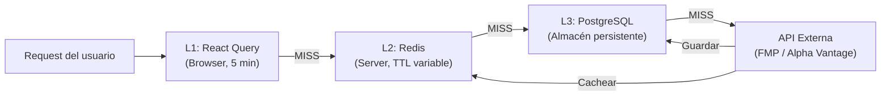
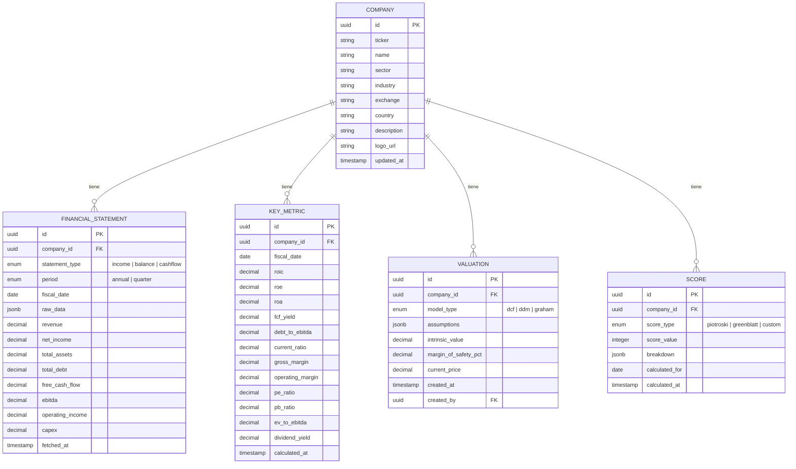
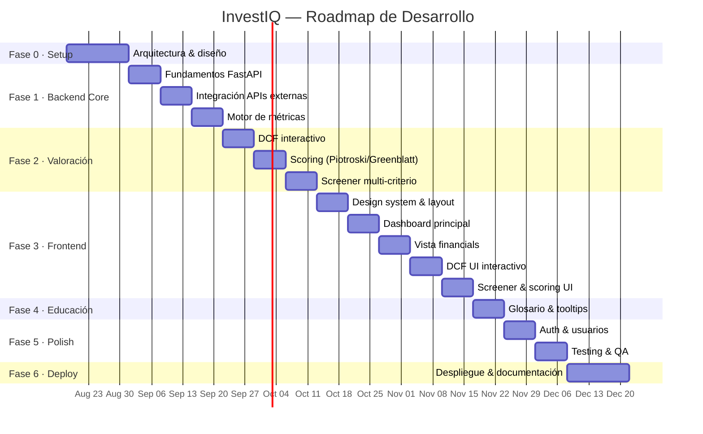

# 📊 InvestIQ — Plataforma de Análisis Financiero & Value Investing

Roadmap completo para construir una plataforma web profesional de análisis fundamental, valoración de empresas y detección de oportunidades de inversión tipo Value Investing.

---

## 1. Stack Tecnológico Recomendado

### Arquitectura General

```mermaid
graph TB
    subgraph Frontend["🖥️ Frontend — React + TypeScript"]
        UI["Dashboards & Charts"]
        DCF_UI["DCF Interactivo"]
        Screener_UI["Screener / Scoring"]
        Glossary["Glosario & Tooltips"]
    end

    subgraph Backend["⚙️ Backend — FastAPI (Python)"]
        API["API REST v1"]
        Auth["Auth JWT"]
        ValEngine["Motor de Valoración"]
        ScoringEngine["Motor de Scoring"]
        CacheLayer["Cache Manager"]
    end

    subgraph Data["🗄️ Capa de Datos"]
        PG["PostgreSQL"]
        Redis["Redis Cache"]
        Celery["Celery Workers"]
    end

    subgraph External["🌐 APIs Externas"]
        FMP["Financial Modeling Prep"]
        AV["Alpha Vantage (fallback)"]
    end

    UI --> API
    DCF_UI --> API
    Screener_UI --> API
    API --> ValEngine
    API --> ScoringEngine
    API --> CacheLayer
    CacheLayer --> Redis
    CacheLayer --> PG
    ValEngine --> PG
    ScoringEngine --> PG
    Celery --> FMP
    Celery --> AV
    Celery --> PG
end
```

### Stack Detallado

| Capa | Tecnología | Justificación |
|:---|:---|:---|
| **Frontend** | React 18+ con TypeScript | Tipado estricto para datos financieros; ecosistema de componentes maduro |
| **Bundler** | Vite | Build rápido, HMR instantáneo |
| **UI Kit** | Shadcn/UI + Radix primitives | Componentes accesibles, personalizables, aspecto premium |
| **Gráficos** | Recharts + Lightweight Charts (TradingView) | Recharts para KPIs/barras; Lightweight Charts para gráficos de precio |
| **Estado** | TanStack Query (React Query) | Caché en cliente, stale-while-revalidate, ideal para datos API |
| **Backend** | FastAPI (Python 3.11+) | Async nativo, validación con Pydantic, autodocumentación OpenAPI |
| **ORM** | SQLAlchemy 2.0 (async) | Soporte async completo, migraciones con Alembic |
| **Task Queue** | Celery + Redis como broker | Tareas pesadas (scraping batch, recálculos) fuera del request cycle |
| **Base de Datos** | PostgreSQL 16 | ACID, JSONB para datos semi-estructurados, extensible |
| **Caché** | Redis 7 | TTL configurable, invalidación selectiva, sub-ms de latencia |
| **Auth** | JWT (jose) + bcrypt | Stateless, estándar de la industria |
| **Testing** | pytest + React Testing Library + Playwright | Unit + integration + E2E |
| **CI/CD** | GitHub Actions | Integración con el repositorio, pipelines automatizados |
| **Deploy** | Docker Compose (dev) → Railway/Render (prod) | Gratuito para portfolio, escalable si crece |
| **Monitoreo** | Structlog + Sentry (free tier) | Logging estructurado + error tracking |

### Librerías Python Clave para Finanzas

| Librería | Uso |
|:---|:---|
| `numpy` / `pandas` | Manipulación de series temporales, cálculos matriciales |
| `scipy.optimize` | Resolución de WACC, TIR (IRR), solver DCF |
| `httpx` | Cliente HTTP async para llamadas a APIs externas |
| `pydantic` | Validación estricta de datos financieros (schemas) |
| `celery[redis]` | Workers para carga batch de datos |

---

## 2. Arquitectura de Datos Financieros

> [!IMPORTANT]
> La clave para un proyecto de portfolio creíble es **no depender en tiempo real de la API externa**. Los datos fundamentales cambian trimestralmente, no en tiempo real.

### Estrategia de Caché en 3 Niveles



| Nivel | Tecnología | TTL | Datos |
|:---|:---|:---|:---|
| **L1 — Cliente** | TanStack Query | 5 min | Respuestas API ya formateadas |
| **L2 — Servidor** | Redis | 1h (precio) / 24h (ratios) / 7d (statements) | JSON serializado |
| **L3 — Persistencia** | PostgreSQL | Permanente (actualización batch) | Tablas normalizadas |

### Modelo de Base de Datos (Core)



### Worker de Sincronización (Celery)

```
┌─────────────────────────────────────────────────────┐
│  Celery Beat (Scheduler)                            │
│  ─────────────────────                              │
│  • Diario 02:00 UTC → sync_prices (todas)           │
│  • Semanal Dom 04:00 → sync_statements (S&P 500)    │
│  • Tras earnings → sync_company(ticker) on-demand   │
└───────────────────┬─────────────────────────────────┘
                    │
          ┌─────────▼──────────┐
          │  Celery Worker(s)  │
          │  ──────────────    │
          │  1. Fetch de API   │
          │  2. Parse & Clean  │
          │  3. Upsert en PG   │
          │  4. Invalidar Redis│
          │  5. Log resultado  │
          └────────────────────┘
```

> [!TIP]
> Con esta arquitectura, la API externa (FMP) solo recibe ~50 llamadas en la carga semanal batch para el S&P 500 (statements agrupados). El usuario nunca espera a la API externa: siempre lee de PostgreSQL o Redis.

---

## 3. Fases de Desarrollo (Sprints)

### Fase 0 — Diseño y Arquitectura (Semana 1-2)

| Tarea | Entregable |
|:---|:---|
| Definir la arquitectura completa | Diagrama C4 en el README |
| Diseñar el esquema de BD | Migraciones Alembic iniciales |
| Configurar monorepo | `/backend` + `/frontend` con scripts unificados |
| Docker Compose | `postgres`, `redis`, `backend`, `frontend`, `celery-worker` |
| Wireframes de la UI | Mockups en Figma o bocetos en papel |
| Configurar CI/CD | GitHub Actions: lint + test en cada PR |
| Crear README profesional | Elevator pitch, diagrama de arquitectura, badges |

**Estructura del repositorio:**
```
investiq/
├── backend/
│   ├── app/
│   │   ├── api/           # Routers FastAPI (v1/)
│   │   ├── core/          # Config, security, exceptions
│   │   ├── models/        # SQLAlchemy models
│   │   ├── schemas/       # Pydantic schemas
│   │   ├── services/      # Business logic
│   │   │   ├── valuation/ # DCF, DDM, Graham
│   │   │   ├── scoring/   # Piotroski, Greenblatt
│   │   │   └── metrics/   # ROIC, WACC, ratios
│   │   ├── workers/       # Celery tasks
│   │   └── db/            # Session, migrations
│   ├── tests/
│   ├── alembic/
│   ├── pyproject.toml
│   └── Dockerfile
├── frontend/
│   ├── src/
│   │   ├── components/    # UI components
│   │   ├── features/      # Feature modules
│   │   ├── hooks/         # Custom hooks
│   │   ├── lib/           # Utils, API client
│   │   ├── pages/         # Route pages
│   │   └── styles/        # Design system
│   ├── package.json
│   └── Dockerfile
├── docker-compose.yml
├── .github/workflows/
├── README.md
└── docs/
    ├── architecture.md
    └── api-spec.md
```

---

### Fase 1 — Backend Core & Ingesta de Datos (Semana 3-5)

**Sprint 1.1 — Fundamentos del Backend (Semana 3)**

- [ ] Setup FastAPI con estructura modular
- [ ] Configuración de SQLAlchemy async + Alembic
- [ ] Modelos de BD: `Company`, `FinancialStatement`, `KeyMetric`
- [ ] Conexión a Redis con `redis-py` async
- [ ] Health check endpoint (`/api/v1/health`)
- [ ] Middleware: CORS, rate limiting, error handling global

**Sprint 1.2 — Integración con API Externa (Semana 4)**

- [ ] Servicio abstracto `DataProvider` (interfaz para swap de APIs)
- [ ] Implementación `FMPProvider` (Financial Modeling Prep)
- [ ] Implementación `AlphaVantageProvider` (fallback)
- [ ] Celery task: `sync_company_data(ticker)`
- [ ] Celery task: `batch_sync_sp500()`
- [ ] Manejo de rate limits, retries con backoff exponencial
- [ ] Tests unitarios del pipeline de ingesta

**Sprint 1.3 — Motor de Métricas (Semana 5)**

- [ ] Servicio `MetricsCalculator`:
  - ROIC = NOPAT / Invested Capital
  - WACC = (E/V)×Re + (D/V)×Rd×(1-T)
  - FCF Yield = FCF / Market Cap
  - Debt/EBITDA
  - Márgenes (bruto, operativo, neto)
  - ROE, ROA, Current Ratio
- [ ] Endpoint: `GET /api/v1/companies/{ticker}/metrics`
- [ ] Endpoint: `GET /api/v1/companies/{ticker}/statements`
- [ ] Caché Redis con invalidación inteligente
- [ ] Tests con datos reales congelados (fixtures)

---

### Fase 2 — Motor de Valoración & Scoring (Semana 6-8)

**Sprint 2.1 — DCF Interactivo (Semana 6)**

- [ ] Servicio `DCFValuation`:
  - Proyección de FCF (3 métodos: histórico, analyst consensus, manual)
  - Cálculo de WACC (CAPM: Rf + β×ERP)
  - Terminal Value (Gordon Growth Model)
  - Valor intrínseco por acción
  - Margen de seguridad (%)
- [ ] Endpoint: `POST /api/v1/valuations/dcf` (acepta supuestos custom)
- [ ] Endpoint: `GET /api/v1/valuations/dcf/{ticker}/default` (supuestos automáticos)
- [ ] Análisis de sensibilidad: matriz WACC × Growth Rate
- [ ] Tests: verificar contra valoraciones DCF conocidas

**Sprint 2.2 — Modelos de Scoring (Semana 7)**

- [ ] Servicio `PiotroskiFScore`:
  - 9 señales binarias (ROA, ΔCash Flow, ΔROA, Accruals, ΔLeverage, ΔLiquidity, Equity Offering, ΔMargin, ΔTurnover)
  - Score 0-9 con desglose detallado
- [ ] Servicio `GreenblattMagicFormula`:
  - Earnings Yield = EBIT / Enterprise Value
  - ROIC ranking
  - Ranking combinado
- [ ] Endpoint: `GET /api/v1/scores/{ticker}/piotroski`
- [ ] Endpoint: `GET /api/v1/scores/{ticker}/greenblatt`
- [ ] Endpoint: `GET /api/v1/screener?model=piotroski&min_score=7`
- [ ] Tests con resultados verificables

**Sprint 2.3 — Screener Multi-criterio (Semana 8)**

- [ ] Endpoint: `GET /api/v1/screener` con filtros:
  - Sector / Industria / País
  - Rango de Market Cap
  - Min/Max para cualquier métrica (PE, ROIC, Debt/EBITDA...)
  - Score mínimo (Piotroski ≥ 7, Greenblatt top 30)
- [ ] Ordenación por múltiples campos
- [ ] Paginación cursor-based
- [ ] Tests de rendimiento (query plan con EXPLAIN)

---

### Fase 3 — Frontend & UX Premium (Semana 9-13)

**Sprint 3.1 — Design System & Layout (Semana 9)**

- [ ] Setup Vite + React + TypeScript
- [ ] Design system: tokens de color, tipografía (Inter), spacing
- [ ] Dark mode nativo (CSS variables + contexto React)
- [ ] Layout principal: sidebar + topbar + content area
- [ ] Componentes base: Card, Badge, Tooltip, DataTable, Skeleton
- [ ] API client con Axios + interceptors de auth/error

**Sprint 3.2 — Dashboard Principal (Semana 10)**

- [ ] Barra de búsqueda con autocompletado de tickers
- [ ] Vista de empresa:
  - Header: Logo, nombre, precio, cambio %, sector
  - Tabs: Resumen | Financials | Valoración | Scoring
- [ ] Tab Resumen:
  - KPIs principales en tarjetas con sparklines
  - Gráfico de precio (Lightweight Charts)
  - Radar chart de salud financiera
- [ ] Tooltips educativos en cada KPI (conectados al glosario)

**Sprint 3.3 — Vista Financials Detallada (Semana 11)**

- [ ] Tabla de estados financieros (Income, Balance, Cash Flow)
  - Toggle anual / trimestral
  - Highlight de tendencias (verde ↑ / rojo ↓)
  - Exportar a CSV
- [ ] Gráficos de evolución de métricas (barras + líneas)
- [ ] Comparador: superponer 2-3 empresas en el mismo gráfico

**Sprint 3.4 — DCF Interactivo en Frontend (Semana 12)**

- [ ] Formulario de supuestos DCF:
  - Sliders para growth rate, WACC, terminal growth
  - Inputs para override de FCF base
  - Presets: "Conservador", "Moderado", "Agresivo"
- [ ] Tabla de proyección de flujos
- [ ] Resultado: valor intrínseco vs precio actual (gauge chart)
- [ ] Matriz de sensibilidad interactiva (heatmap)
- [ ] Explicación paso-a-paso del cálculo (stepper educativo)

**Sprint 3.5 — Screener & Scoring UI (Semana 13)**

- [ ] Tabla del screener con filtros avanzados
- [ ] Tarjeta de scoring por empresa:
  - Piotroski: 9 barras con ✅/❌ por criterio
  - Greenblatt: ranking visual con posición
- [ ] Vista de ranking global (top 20 por modelo)
- [ ] Animaciones de carga y transiciones entre vistas

---

### Fase 4 — Educación Integrada & Glosario (Semana 14)

- [ ] Sistema de tooltips contextuales:
  - Hover sobre cualquier KPI → definición + fórmula + interpretación
  - Link a glosario completo
- [ ] Página `/learn` — Glosario financiero interactivo:
  - Búsqueda por término
  - Categorías: Rentabilidad, Solvencia, Valoración, Eficiencia
  - Cada término incluye: definición, fórmula LaTeX, ejemplo real, interpretación
- [ ] "Modo Aprendizaje" toggle:
  - Activado: muestra explicaciones expandidas bajo cada cálculo
  - Desactivado: vista limpia para usuarios avanzados
- [ ] Mini-tutoriales en la vista DCF (cómo interpretar cada paso)

---

### Fase 5 — Auth, Polish & Testing (Semana 15-16)

**Sprint 5.1 — Autenticación y Usuarios (Semana 15)**

- [ ] Registro / Login con JWT
- [ ] Protección de rutas (frontend + backend)
- [ ] Guardar valoraciones del usuario (historial de DCFs)
- [ ] Watchlist personalizada
- [ ] Rate limiting por usuario

**Sprint 5.2 — Testing & QA (Semana 16)**

- [ ] Backend:
  - Unit tests: servicios de valoración, scoring, métricas (pytest)
  - Integration tests: endpoints API con TestClient
  - Fixtures con datos financieros reales congelados
  - Coverage > 80%
- [ ] Frontend:
  - Component tests con React Testing Library
  - E2E críticos con Playwright (búsqueda → DCF → resultado)
- [ ] Performance:
  - Lighthouse audit (target: >90 en todas las categorías)
  - API response time < 200ms (con caché caliente)

---

### Fase 6 — Despliegue & Documentación (Semana 17-18)

- [ ] Dockerización completa (multi-stage builds)
- [ ] Deploy en Railway / Render / Fly.io:
  - Backend + Celery worker
  - PostgreSQL (managed)
  - Redis (managed)
  - Frontend (Vercel o mismo servicio)
- [ ] Dominio custom (opcional): `investiq.dev`
- [ ] README definitivo con:
  - Descripción del proyecto (elevator pitch)
  - Screenshot / GIF demo
  - Diagrama de arquitectura
  - Instrucciones de setup local
  - Documentación de la API (link a Swagger autogenerado)
  - Badges: CI status, coverage, license
- [ ] OpenAPI spec exportada (`/docs` de FastAPI)
- [ ] Video demo de 2-3 minutos (Loom) para el CV

---

## 4. Recomendaciones para el CV & GitHub

### 🎯 Qué Destacar en el Repositorio

> [!IMPORTANT]
> Un reclutador de fintech invierte ~30 segundos en un repo. Tu README debe comunicar **competencia técnica** y **conocimiento del dominio financiero** en ese tiempo.

#### README — Estructura Ganadora

```markdown
# 📊 InvestIQ — Value Investing Analysis Platform

> Plataforma de análisis fundamental que evalúa empresas del S&P 500
> usando DCF, Piotroski F-Score y Fórmula Mágica de Greenblatt.
> Datos reales · Valoraciones interactivas · Educación financiera integrada.

[🔗 Live Demo](https://investiq.dev) · [📖 API Docs](https://api.investiq.dev/docs)

## ⚡ Highlights
- Motor DCF con análisis de sensibilidad (WACC × Growth)
- Scoring automático: Piotroski (0-9) y Greenblatt ranking
- Caché en 3 niveles (React Query → Redis → PostgreSQL)
- Pipeline async de datos con Celery (batch nocturno)
- +30 KPIs calculados con tooltips educativos

## 🏗️ Architecture
[Diagrama aquí]

## 🛠️ Tech Stack
FastAPI · React · TypeScript · PostgreSQL · Redis · Celery · Docker
```

#### Carpetas/Archivos que Impresionan

| Elemento | Por qué importa |
|:---|:---|
| `backend/app/services/valuation/dcf.py` | Demuestra lógica financiera avanzada (WACC, FCFF, Terminal Value) |
| `backend/app/services/scoring/piotroski.py` | Implementación de paper académico → código |
| `backend/app/services/providers/base.py` | Patrón Strategy para abstraer APIs → diseño SOLID |
| `tests/services/test_dcf_valuation.py` | Tests con fixtures de datos reales: rigor profesional |
| `docker-compose.yml` | Infraestructura como código, "un comando y funciona" |
| `docs/architecture.md` | Pensamiento sistémico, documentación de decisiones |
| `.github/workflows/ci.yml` | CI/CD automatizado desde el día 1 |

#### Commits que Comunican Profesionalidad

```
feat(valuation): implement DCF model with Gordon Growth terminal value
feat(scoring): add Piotroski F-Score with 9-signal breakdown
perf(cache): add Redis L2 cache with TTL-based invalidation
refactor(providers): extract DataProvider interface for API abstraction
test(dcf): add fixtures with AAPL 2023 financials for regression testing
docs(readme): add architecture diagram and setup instructions
ci: add GitHub Actions pipeline with pytest + coverage reporting
```

### 📝 Cómo Describirlo en el CV

> [!TIP]
> Usa verbos de acción + métricas cuantificables + tecnologías específicas.

#### Sección de Proyectos — Ejemplo

```
INVESTIQ — Value Investing Analysis Platform
─────────────────────────────────────────────
• Architected a full-stack financial analysis platform (FastAPI + React/TS + PostgreSQL)
  that screens S&P 500 companies using DCF valuation, Piotroski F-Score, and Greenblatt's
  Magic Formula, processing 30+ KPIs per company.

• Engineered a 3-tier caching architecture (React Query → Redis → PostgreSQL) reducing
  API dependency by 95% and achieving <200ms response times for financial data queries.

• Implemented an interactive DCF model with sensitivity analysis (WACC × Growth Rate matrix),
  enabling users to customize valuation assumptions and visualize margin-of-safety scenarios.

• Built an async data pipeline with Celery workers for batch ingestion of financial statements,
  handling rate-limited external APIs with exponential backoff and circuit-breaker patterns.

• Achieved 85%+ test coverage with pytest fixtures using frozen financial data,
  and deployed with Docker Compose + CI/CD via GitHub Actions.

Tech: Python · FastAPI · React · TypeScript · PostgreSQL · Redis · Celery · Docker
```

### 🏦 Keywords para Roles Específicos

| Sector | Keywords a incluir |
|:---|:---|
| **Fintech** | API design, async pipelines, caching, CI/CD, microservices, Docker |
| **Banca de Inversión** | DCF, WACC, CAPM, Free Cash Flow, Terminal Value, financial modeling |
| **Fondos / Asset Management** | Screening, factor investing, Piotroski, Greenblatt, ROIC, systematic analysis |
| **Data Engineering** | ETL pipeline, batch processing, Redis, PostgreSQL, Celery, data validation |

---

## 5. Cronograma Visual



**Duración total estimada: ~18 semanas** (trabajando como side-project, ~10-15h/semana)

---

## 6. Open Questions

> [!IMPORTANT]
> Estas decisiones afectan al scope y necesito tu input antes de empezar:

1. **API de datos**: ¿Prefieres **Financial Modeling Prep** (250 calls/día gratis, excelente para fundamentals) o **Alpha Vantage** (25 calls/día, más limitado pero más simple)? Mi recomendación es FMP como primaria y Alpha Vantage como fallback.

2. **Scope del universo de empresas**: ¿Solo S&P 500 (~500 empresas USA) o también mercados internacionales? Para portfolio/CV, S&P 500 es suficiente y mucho más manejable.

3. **Autenticación**: ¿Quieres un sistema de usuarios completo (registro, login, watchlists guardadas) o prefieres mantenerlo simple (sin auth, todo público)? Para impresionar, un auth básico con JWT suma puntos.

4. **Idioma de la interfaz**: ¿En inglés (más universal, mejor para recruiters internacionales) o español (más personal)?

5. **¿Quieres que empecemos a implementar ya?** Si confirmas el plan, puedo arrancar con la Fase 0: scaffolding del monorepo, Docker Compose, modelos de BD, y la estructura base de FastAPI + React.
