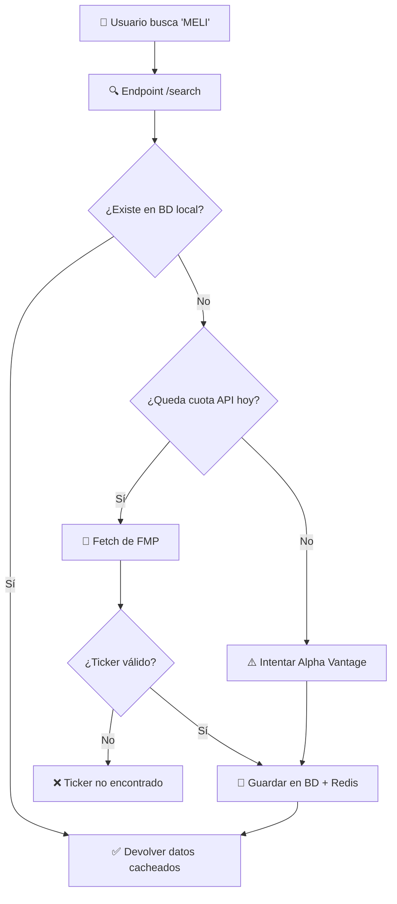
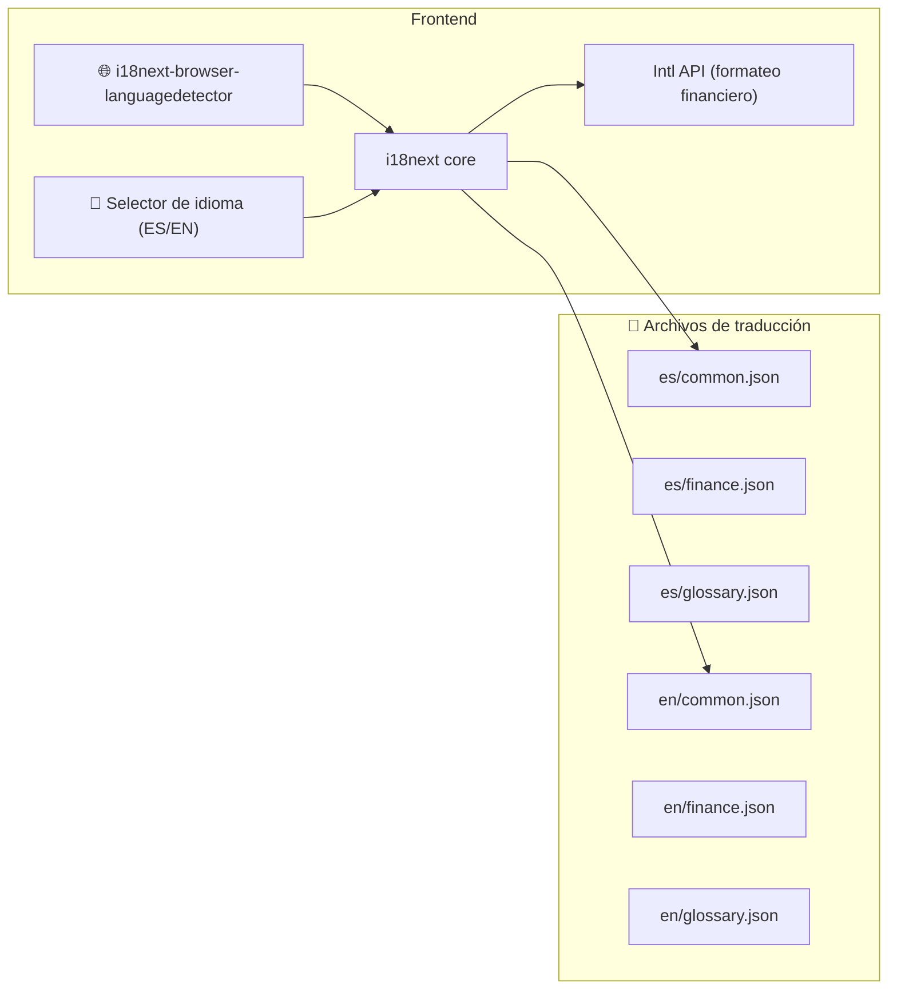
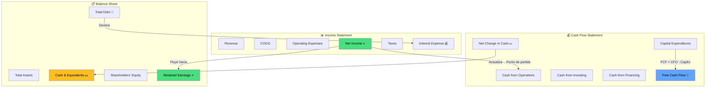
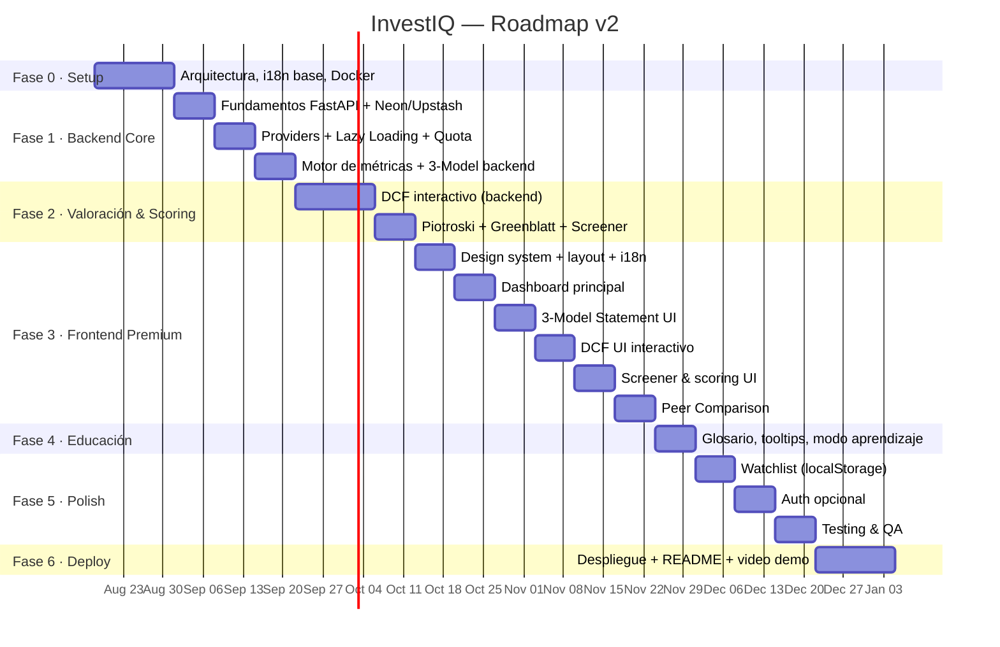

# 📊 InvestIQ — Roadmap v2 (Actualizado)

Roadmap completo incorporando todas las decisiones confirmadas y mejoras sugeridas.

---

## Decisiones Confirmadas

| # | Decisión | Resolución |
|:--|:---------|:-----------|
| 1 | API de datos | **FMP primaria** + Alpha Vantage fallback ✅ |
| 2 | Universo de empresas | **Flexible** — cualquier empresa listada en US exchanges (ver estrategia abajo) |
| 3 | Autenticación | **Diferida** — se implementa como módulo opcional en Fase 5 |
| 4 | Idioma | **Políglota** — Español por defecto, inglés seleccionable (i18n) |
| 5 | Coste | **100% gratuito** — análisis de costes incluido abajo |
| 6 | 3-Model Statement | **Sí** — integrado como feature core |

---

## 1. Estrategia de Universo Flexible de Empresas

> [!IMPORTANT]
> Buenas noticias: MELI, NIO, ONON (On Holding), DUOL (Duolingo) y cualquier empresa que cotice en NYSE o NASDAQ están cubiertas por el **free tier de FMP**. No necesitas plan de pago para estas.

### Modelo "Search & Discover" (Lazy Loading)

En vez de pre-cargar un índice fijo (S&P 500), el sistema funciona así:



### Gestión de la Cuota Diaria (250 calls FMP)

| Concepto | Calls API | Estrategia |
|:---------|:----------|:-----------|
| **Primera búsqueda de una empresa** | ~5 calls | Profile + Income + Balance + CashFlow + Metrics |
| **Actualización de empresa existente** | ~4 calls | Solo statements + metrics (profile ya cacheado) |
| **Búsqueda de ticker (autocomplete)** | 1 call | Endpoint `/search` de FMP |
| **Precio actualizado** | 1 call | Quote endpoint |

**Presupuesto diario recomendado:**

```
250 calls/día ÷ ~5 calls/empresa nueva = ~50 empresas nuevas/día
                                        + ~100 actualizaciones de empresas existentes
```

> [!TIP]
> Para un proyecto personal, esto es más que suficiente. Podrías indexar todo el NASDAQ 100 en 2 días. Las actualizaciones solo se lanzan cuando el usuario visita una empresa cuyo caché ha expirado (statements TTL = 30 días, precio TTL = 1 día).

### Tabla `company_universe` — Control del Universo

```sql
CREATE TABLE company_universe (
    ticker          VARCHAR(10) PRIMARY KEY,
    name            VARCHAR(255),
    exchange        VARCHAR(20),   -- NYSE, NASDAQ
    sector          VARCHAR(100),
    is_active       BOOLEAN DEFAULT true,
    first_fetched   TIMESTAMP,
    last_synced     TIMESTAMP,
    sync_priority   SMALLINT DEFAULT 0,  -- 0=on-demand, 1=weekly, 2=daily
    data_quality    SMALLINT DEFAULT 0   -- 0=parcial, 1=completo, 2=verificado
);
```

- **`sync_priority = 0`** (default): Solo se actualiza cuando el usuario la visita y el caché expiró
- **`sync_priority = 1`**: Se incluye en el batch semanal de Celery (para las "favoritas")
- **`sync_priority = 2`**: Se actualiza diariamente (pocas, para precio)

---

## 2. Análisis de Costes — 100% Gratuito

> [!NOTE]
> Todo el stack puede correr en free tiers. Las limitaciones son tolerables para un proyecto de portfolio personal.

| Servicio | Plan | Límite Free | ¿Suficiente? |
|:---------|:-----|:------------|:-------------|
| **FMP** (datos financieros) | Free | 250 calls/día, US exchanges | ✅ Más que suficiente para uso personal |
| **Alpha Vantage** (fallback) | Free | 25 calls/día | ✅ Como respaldo |
| **Neon** (PostgreSQL) | Free | 0.5 GB storage, 100 compute-hours/mes | ✅ Los datos financieros pesan poco (~200MB para 500+ empresas) |
| **Upstash** (Redis) | Free | 256 MB, 500K commands/mes | ✅ Caché de respuestas JSON |
| **Render** (Backend + Celery) | Free | 750 instance-hours/mes, spin-down 15min | ⚠️ Cold starts de ~30s, tolerable para portfolio |
| **Vercel** (Frontend) | Hobby | 100 GB bandwidth/mes | ✅ Perfecto para React SPA |
| **GitHub Actions** (CI/CD) | Free | 2000 min/mes | ✅ Más que suficiente |
| **Sentry** (errores) | Free | 5K events/mes | ✅ Monitoring básico |
| **Total mensual** | | | **$0.00** |

> [!WARNING]
> **Render Free Tier**: La BD PostgreSQL de Render expira a los 30 días. Por eso usamos **Neon** como BD (persistente, free forever). El backend en Render se duerme tras 15 min de inactividad — el primer request tras un sleep tarda ~30s (cold start). Es un trade-off aceptable para portfolio: se puede mitigar con un cron job que haga ping cada 14 min desde GitHub Actions.

### Mitigación del Cold Start (Opcional)

```yaml
# .github/workflows/keep-alive.yml
name: Keep Backend Alive
on:
  schedule:
    - cron: '*/14 6-22 * * *'  # Cada 14 min, de 6:00 a 22:00
jobs:
  ping:
    runs-on: ubuntu-latest
    steps:
      - run: curl -s https://investiq-api.onrender.com/api/v1/health
```

---

## 3. Internacionalización (i18n) — App Políglota

### Arquitectura i18n



### Stack i18n

| Librería | Función |
|:---------|:--------|
| `react-i18next` | Core de traducciones, hook `useTranslation()` |
| `i18next-http-backend` | Lazy loading de archivos de idioma por namespace |
| `i18next-browser-languagedetector` | Detecta idioma del navegador automáticamente |
| `Intl.NumberFormat` / `Intl.DateTimeFormat` | Formateo financiero locale-aware (nativo JS) |

### Estructura de Namespaces

```
frontend/public/locales/
├── es/
│   ├── common.json       # UI general: "Buscar", "Guardar", "Inicio"
│   ├── finance.json      # Términos: "Flujo de Caja Libre", "Margen Operativo"
│   ├── glossary.json     # Definiciones educativas
│   ├── valuation.json    # "Valor Intrínseco", "Tasa de Descuento"
│   └── screener.json     # "Puntuación", "Clasificación"
└── en/
    ├── common.json       # "Search", "Save", "Home"
    ├── finance.json      # "Free Cash Flow", "Operating Margin"
    ├── glossary.json     # Educational definitions
    ├── valuation.json    # "Intrinsic Value", "Discount Rate"
    └── screener.json     # "Score", "Ranking"
```

### Formateo Financiero Locale-Aware

```typescript
// Misma cifra, diferente formato según locale
Intl.NumberFormat('es-ES', { style: 'currency', currency: 'USD' })
  .format(1234567.89)
// → "1.234.567,89 US$"

Intl.NumberFormat('en-US', { style: 'currency', currency: 'USD' })
  .format(1234567.89)
// → "$1,234,567.89"
```

> [!TIP]
> El backend siempre devuelve datos en inglés (nombres de campos, labels de API). La traducción ocurre 100% en el frontend. Esto mantiene la API limpia y universal.

---

## 4. 3-Model Statement (Modelo de 3 Estados Financieros)

### ¿Qué es?

El **3-Statement Model** es la piedra angular del análisis financiero profesional: los tres estados financieros (Income Statement, Balance Sheet, Cash Flow Statement) están **interconectados** — un cambio en uno afecta a los otros.

### Implementación en InvestIQ



### UX del 3-Model Statement

| Feature | Descripción |
|:--------|:------------|
| **Vista enlazada** | 3 tablas side-by-side (en desktop) o tabs (en mobile) |
| **Highlight de conexiones** | Al hacer hover sobre "Net Income" en el Income Statement, se resalta "Retained Earnings" en Balance y el inicio de CFO en Cash Flow |
| **Toggle temporal** | Selector: Anual (5 años) / Trimestral (últimos 8 quarters) |
| **Tendencias visuales** | Flechas ↑↓ con color (verde/rojo) en cada línea vs. período anterior |
| **Tooltip educativo** | Cada partida tiene un tooltip con: definición, fórmula, cómo interpretarla |
| **Exportar** | Botón de descarga CSV/PDF de los 3 estados |

> [!TIP]
> Esta feature es un **diferenciador masivo** para el CV. Muy pocas apps de portfolio tienen un 3-model statement interactivo con highlighting de conexiones. Es exactamente lo que un analista de banca de inversión esperaría ver.

---

## 5. Stack Tecnológico (Actualizado)

| Capa | Tecnología | Justificación |
|:---|:---|:---|
| **Frontend** | React 18+ con TypeScript | Tipado estricto para datos financieros |
| **Bundler** | Vite | Build rápido, HMR instantáneo |
| **UI Kit** | Shadcn/UI + Radix | Componentes accesibles y personalizables |
| **Gráficos** | Recharts + Lightweight Charts | KPIs + gráficos de precio tipo TradingView |
| **i18n** | react-i18next + Intl API | Políglota con formateo financiero locale-aware |
| **Estado** | TanStack Query (React Query) | Caché L1 en cliente |
| **Backend** | FastAPI (Python 3.11+) | Async, Pydantic, OpenAPI auto |
| **ORM** | SQLAlchemy 2.0 async + Alembic | Migraciones, async queries |
| **Task Queue** | Celery + Redis broker | Batch sync, recálculos |
| **BD Principal** | PostgreSQL (Neon free) | ACID, JSONB, persistente gratis |
| **Caché** | Redis (Upstash free) | TTL configurable, sub-ms |
| **Testing** | pytest + RTL + Playwright | Unit + component + E2E |
| **CI/CD** | GitHub Actions | Lint + test + deploy automático |
| **Frontend Host** | Vercel (Hobby) | SPA optimizada, CDN global |
| **Backend Host** | Render (Free) | Con keep-alive cron |
| **Errores** | Sentry (Free) | Error tracking |

---

## 6. Fases de Desarrollo (Sprints)

### Fase 0 — Diseño y Arquitectura (Semana 1-2)

| Tarea | Entregable |
|:---|:---|
| Diseñar la arquitectura completa | Diagrama C4 en el README |
| Diseñar el esquema de BD | Migraciones Alembic iniciales |
| Configurar monorepo | `/backend` + `/frontend` con scripts unificados |
| Docker Compose | `postgres`, `redis`, `backend`, `frontend`, `celery-worker` |
| Setup i18n base | Estructura de locales, config de react-i18next |
| Wireframes de la UI | Mockups (o bocetos en papel) |
| Configurar CI/CD | GitHub Actions: lint + test en cada PR |
| Crear README profesional | Elevator pitch, diagrama, badges |

**Estructura del repositorio:**
```
investiq/
├── backend/
│   ├── app/
│   │   ├── api/v1/            # Routers FastAPI versionados
│   │   ├── core/              # Config, security, exceptions
│   │   ├── models/            # SQLAlchemy models
│   │   ├── schemas/           # Pydantic schemas
│   │   ├── services/
│   │   │   ├── providers/     # FMP, AlphaVantage (Strategy pattern)
│   │   │   ├── valuation/     # DCF, Graham
│   │   │   ├── scoring/       # Piotroski, Greenblatt
│   │   │   ├── metrics/       # ROIC, WACC, ratios
│   │   │   └── statements/    # 3-Model Statement logic
│   │   ├── workers/           # Celery tasks
│   │   └── db/                # Session, migrations
│   ├── tests/
│   │   ├── unit/
│   │   ├── integration/
│   │   └── fixtures/          # Datos financieros congelados
│   ├── alembic/
│   ├── pyproject.toml
│   └── Dockerfile
├── frontend/
│   ├── public/
│   │   └── locales/           # 🌐 Archivos i18n (es/, en/)
│   ├── src/
│   │   ├── components/        # UI components reutilizables
│   │   ├── features/          # Módulos por feature
│   │   │   ├── dashboard/
│   │   │   ├── statements/    # 3-Model Statement UI
│   │   │   ├── valuation/     # DCF interactivo
│   │   │   ├── screener/      # Scoring & filtros
│   │   │   └── learn/         # Glosario educativo
│   │   ├── hooks/
│   │   ├── i18n/              # Config i18next
│   │   ├── lib/               # API client, utils
│   │   └── styles/            # Design system (CSS vars)
│   ├── package.json
│   └── Dockerfile
├── docker-compose.yml
├── .github/workflows/
├── README.md
└── docs/
```

---

### Fase 1 — Backend Core & Ingesta de Datos (Semana 3-5)

**Sprint 1.1 — Fundamentos del Backend (Semana 3)**

- [ ] Setup FastAPI con estructura modular
- [ ] SQLAlchemy async + Alembic + conexión a Neon
- [ ] Modelos: `Company`, `FinancialStatement`, `KeyMetric`, `CompanyUniverse`
- [ ] Conexión a Upstash Redis
- [ ] Health check endpoint
- [ ] Middleware: CORS, rate limiting, error handling, logging estructurado
- [ ] Tests de infraestructura (conexiones BD/Redis)

**Sprint 1.2 — Sistema de Providers & Ingesta (Semana 4)**

- [ ] Interfaz abstracta `DataProvider` (Strategy pattern)
- [ ] `FMPProvider` — implementación principal
- [ ] `AlphaVantageProvider` — fallback automático
- [ ] Servicio `QuotaManager` — tracking de calls/día con reset automático
- [ ] Endpoint: `GET /api/v1/search?q=MELI` (buscar tickers)
- [ ] Endpoint: `GET /api/v1/companies/{ticker}` (fetch lazy + cache)
- [ ] Celery tasks: `sync_company(ticker)`, `batch_update(tickers[])`
- [ ] Rate limiting, retries con exponential backoff, circuit breaker
- [ ] Tests unitarios con mocks de APIs externas

**Sprint 1.3 — Motor de Métricas & 3-Model Backend (Semana 5)**

- [ ] Servicio `MetricsCalculator` — 30+ KPIs:

  | Categoría | Métricas |
  |:----------|:---------|
  | Rentabilidad | ROIC, ROE, ROA, Margen Bruto/Operativo/Neto |
  | Solvencia | Debt/EBITDA, Debt/Equity, Current Ratio, Interest Coverage |
  | Valoración | P/E, P/B, EV/EBITDA, FCF Yield, Dividend Yield |
  | Eficiencia | Asset Turnover, Inventory Turnover, Days Payable |
  | Crecimiento | Revenue Growth, EPS Growth, FCF Growth (YoY, CAGR 3/5 años) |

- [ ] Servicio `ThreeStatementModel`:
  - Mapeo de conexiones entre partidas (Net Income → Retained Earnings → CFO)
  - Cálculo de variaciones inter-período (Δ% YoY)
  - Detección de "banderas rojas" (ej: Net Income positivo + CFO negativo)
- [ ] Endpoints:
  - `GET /api/v1/companies/{ticker}/metrics`
  - `GET /api/v1/companies/{ticker}/statements?type=income&period=annual`
  - `GET /api/v1/companies/{ticker}/three-model`
- [ ] Caché Redis con TTLs diferenciados
- [ ] Tests con fixtures de datos reales (AAPL, MELI congelados)

---

### Fase 2 — Motor de Valoración & Scoring (Semana 6-8)

**Sprint 2.1 — DCF Interactivo (Semana 6-7)**

- [ ] Servicio `DCFValuation`:

  ```
  1. FCF Base → Proyección (5-10 años)
     Métodos: Media histórica | Crecimiento estimado | Input manual
  2. WACC = (E/V) × Re + (D/V) × Rd × (1-T)
     Re = Rf + β × ERP  (CAPM)
  3. Terminal Value = FCF_n × (1+g) / (WACC - g)  (Gordon Growth)
  4. Enterprise Value = Σ PV(FCFs) + PV(Terminal Value)
  5. Equity Value = EV - Net Debt
  6. Intrinsic Value/Share = Equity Value / Shares Outstanding
  7. Margin of Safety = (Intrinsic - Current Price) / Intrinsic
  ```

- [ ] **Análisis de Sensibilidad**: Matriz WACC × Terminal Growth Rate
- [ ] **Escenarios**: Conservador / Base / Optimista (presets ajustables)
- [ ] Endpoints:
  - `POST /api/v1/valuations/dcf` (custom assumptions)
  - `GET /api/v1/valuations/dcf/{ticker}/auto` (con defaults inteligentes)
  - `GET /api/v1/valuations/dcf/{ticker}/sensitivity` (matriz)
- [ ] Validaciones: WACC > g, FCF base > 0 o advertencia
- [ ] Tests contra valoraciones DCF verificadas manualmente

**Sprint 2.2 — Modelos de Scoring (Semana 8)**

- [ ] Servicio `PiotroskiFScore` — 9 señales binarias:

  | # | Señal | Categoría | Criterio |
  |:--|:------|:----------|:---------|
  | 1 | ROA | Rentabilidad | ROA > 0 |
  | 2 | CFO | Rentabilidad | CFO > 0 |
  | 3 | ΔROA | Rentabilidad | ROA(t) > ROA(t-1) |
  | 4 | Accruals | Calidad | CFO > Net Income |
  | 5 | ΔLeverage | Apalancamiento | LT Debt/Assets ↓ |
  | 6 | ΔLiquidity | Apalancamiento | Current Ratio ↑ |
  | 7 | Dilución | Apalancamiento | No emisión de acciones |
  | 8 | ΔMargin | Eficiencia | Gross Margin ↑ |
  | 9 | ΔTurnover | Eficiencia | Asset Turnover ↑ |

- [ ] Servicio `GreenblattMagicFormula`:
  - Earnings Yield = EBIT / Enterprise Value
  - ROIC = EBIT / (Net Fixed Assets + Working Capital)
  - Ranking combinado (menor rank sum = mejor)
- [ ] Servicio `Screener` — motor de filtrado multi-criterio:
  - Filtros por sector, industria, market cap, país
  - Filtros por rango de cualquier métrica
  - Filtros por score mínimo
  - Ordenación multi-campo, paginación cursor-based
- [ ] Endpoints:
  - `GET /api/v1/scores/{ticker}/piotroski`
  - `GET /api/v1/scores/{ticker}/greenblatt`
  - `GET /api/v1/screener?model=piotroski&min_score=7&sector=Technology`
- [ ] Tests con resultados verificables

---

### Fase 3 — Frontend & UX Premium (Semana 9-14)

**Sprint 3.1 — Design System, Layout & i18n (Semana 9)**

- [ ] Setup Vite + React + TypeScript + react-i18next
- [ ] Design system CSS:
  - Tokens: colores (dark mode nativo), tipografía (Inter), spacing, radii
  - CSS variables para theming (`--color-primary`, `--color-success`, etc.)
- [ ] Componentes base: `Card`, `Badge`, `Tooltip`, `DataTable`, `Skeleton`, `LanguageSwitcher`
- [ ] Layout: sidebar colapsable + topbar (search + lang switch + theme toggle) + content area
- [ ] API client: Axios + interceptors + TanStack Query setup
- [ ] Archivos de traducción iniciales (`es/common.json`, `en/common.json`)

**Sprint 3.2 — Dashboard Principal (Semana 10)**

- [ ] Barra de búsqueda con autocompletado de tickers (debounced)
- [ ] Vista de empresa — Header:
  - Logo, nombre, ticker, precio actual, cambio %, sector/industria
- [ ] Vista de empresa — Tabs: `Resumen` | `Financials` | `Valoración` | `Scoring`
- [ ] Tab **Resumen**:
  - KPIs en tarjetas con sparklines y semáforo (🟢 bueno / 🟡 neutro / 🔴 alerta)
  - Gráfico de precio (Lightweight Charts — estilo TradingView)
  - Radar chart de salud financiera (6 ejes: Rentabilidad, Solvencia, Crecimiento, Eficiencia, Valoración, Calidad)
- [ ] Tooltips educativos en cada KPI → conectados al glosario
- [ ] Toda la UI traducible (ES/EN)

**Sprint 3.3 — 3-Model Statement UI (Semana 11)**

- [ ] Vista de 3 estados financieros enlazados:
  - Desktop: 3 columnas side-by-side con scroll sincronizado
  - Mobile: Tabs (Income | Balance | Cash Flow)
- [ ] **Highlighting de conexiones**: hover sobre Net Income resalta Retained Earnings + inicio CFO
- [ ] Toggle anual (5 años) / trimestral (8 quarters)
- [ ] Indicadores de tendencia: flechas ↑↓ con color por cada línea vs período anterior
- [ ] Detección de banderas rojas (badge ⚠️):
  - Net Income ↑ pero CFO ↓ → "Posible baja calidad de beneficios"
  - Deuda creciendo más rápido que Revenue → "Apalancamiento creciente"
  - FCF consistentemente < Net Income → "Revisar CapEx y working capital"
- [ ] Exportar a CSV
- [ ] Cada partida con tooltip educativo

**Sprint 3.4 — DCF Interactivo UI (Semana 12)**

- [ ] Formulario de supuestos DCF:
  - Sliders para: growth rate, WACC, terminal growth, años de proyección
  - Inputs numéricos para override de FCF base
  - Presets: "Conservador" / "Moderado" / "Optimista"
- [ ] Tabla de proyección de flujos (año a año con PV de cada flujo)
- [ ] Resultado: valor intrínseco vs precio actual
  - Gauge chart (tipo velocímetro) con margen de seguridad
  - Badge: "Infravalorada" 🟢 / "Precio justo" 🟡 / "Sobrevalorada" 🔴
- [ ] **Matriz de sensibilidad interactiva** (heatmap WACC × Growth)
- [ ] Stepper educativo: explicación paso-a-paso del cálculo
- [ ] Toda la UI traducible

**Sprint 3.5 — Screener & Scoring UI (Semana 13)**

- [ ] **Tabla del screener** con filtros avanzados en panel lateral
- [ ] Tarjetas de scoring por empresa:
  - Piotroski: 9 barras con ✅/❌ por criterio + score total prominente
  - Greenblatt: ranking visual con posición en el universo
- [ ] Vista de ranking global: top 20 por modelo
- [ ] Animaciones de carga, transiciones entre vistas, micro-interacciones

**Sprint 3.6 — Peer Comparison (Semana 14)**

- [ ] Comparador de empresas (2-3 simultáneas):
  - Selector de tickers a comparar
  - Tabla comparativa de KPIs side-by-side
  - Gráficos superpuestos (Revenue growth, margins, ROIC)
  - Radar chart comparativo
- [ ] Poder acceder desde la vista de empresa ("Comparar con...")
- [ ] Toda la UI traducible

---

### Fase 4 — Educación Integrada & Glosario (Semana 15)

- [ ] Sistema de tooltips contextuales:
  - Hover sobre cualquier KPI → definición + fórmula + cómo interpretar
  - Link al glosario completo
- [ ] Página `/learn` — Glosario financiero interactivo:
  - Búsqueda por término
  - Categorías: Rentabilidad, Solvencia, Valoración, Eficiencia, Cash Flow
  - Cada término: definición, fórmula (renderizada en LaTeX), ejemplo real con datos, interpretación
- [ ] **"Modo Aprendizaje"** toggle global:
  - ON: muestra explicaciones expandidas bajo cada cálculo y gráfico
  - OFF: vista limpia para usuarios avanzados
- [ ] Mini-tutoriales en la vista DCF (cómo interpretar cada paso)
- [ ] Todo el contenido educativo traducido ES/EN

---

### Fase 5 — Auth (Opcional), Polish & Testing (Semana 16-18)

**Sprint 5.1 — Watchlist & Persistencia Local (Semana 16)**

- [ ] **Watchlist con `localStorage`** (sin necesidad de auth):
  - Añadir/quitar empresas de la watchlist
  - Dashboard de watchlist: KPIs resumidos + alertas de cambio significativo
  - Persistente entre sesiones del navegador
- [ ] Guardar último DCF configurado por empresa (localStorage)
- [ ] Exportar watchlist como JSON (importable en otro navegador)

**Sprint 5.2 — Autenticación (Opcional/Diferido) (Semana 17)**

> [!NOTE]
> Este sprint es **opcional**. Puedes saltártelo y añadirlo después sin romper nada. La arquitectura lo soporta porque watchlist y DCFs ya funcionan con localStorage.

- [ ] Registro / Login con JWT (bcrypt + jose)
- [ ] Migrar watchlist de localStorage → BD (si el usuario se registra)
- [ ] Guardar historial de valoraciones DCF en BD
- [ ] Protección de rutas (frontend guards + backend middleware)
- [ ] Rate limiting por usuario autenticado

**Sprint 5.3 — Testing & QA (Semana 18)**

- [ ] **Backend:**
  - Unit tests: DCF, Piotroski, Greenblatt, MetricsCalculator (pytest)
  - Integration tests: endpoints API con TestClient de FastAPI
  - Fixtures con datos reales congelados (AAPL, MELI, MSFT, NIO)
  - Coverage objetivo: >80%
- [ ] **Frontend:**
  - Component tests con React Testing Library
  - Tests de i18n: verificar que todos los keys existen en ambos idiomas
  - E2E con Playwright:
    - Flujo: Buscar empresa → ver financials → ejecutar DCF → ver resultado
    - Flujo: Cambiar idioma → verificar que toda la UI cambia
    - Flujo: Screener → filtrar → ver scoring
- [ ] **Performance:**
  - Lighthouse audit (target: >90 todas las categorías)
  - API response time < 200ms (caché caliente)
  - Bundle size analysis (target: < 300KB gzipped)

---

### Fase 6 — Despliegue & Documentación (Semana 19-20)

- [ ] Dockerización completa (multi-stage builds)
- [ ] Deploy:
  - Frontend → Vercel (conectado a repo GitHub, auto-deploy en push)
  - Backend → Render (Free tier + keep-alive cron)
  - PostgreSQL → Neon (Free, persistente)
  - Redis → Upstash (Free, serverless)
  - Celery Worker → Render (segundo servicio, o integrado como background worker)
- [ ] GitHub Actions pipeline completo:
  - PR → lint + type-check + tests
  - Merge to main → deploy automático
  - Cron → keep-alive + batch sync
- [ ] **README definitivo:**
  - Elevator pitch
  - Screenshot / GIF demo animado
  - Diagrama de arquitectura
  - Tech stack con badges
  - Setup local en 3 comandos (`docker-compose up`)
  - Link a API docs (Swagger autogenerado por FastAPI)
  - Link a demo en vivo
- [ ] Video demo (2-3 min, Loom) para el CV
- [ ] Exportar OpenAPI spec

---

## 7. Cronograma Visual



**Duración total: ~20 semanas** (~10-15h/semana como side-project)

---

## 8. Recomendaciones para el CV & GitHub

### Qué Destacar en el Repositorio

#### README — Estructura Ganadora

```markdown
# 📊 InvestIQ — Value Investing Analysis Platform

> Plataforma de análisis fundamental que evalúa empresas cotizadas en US
> usando DCF, Piotroski F-Score y Fórmula Mágica de Greenblatt.
> Datos reales · 3-Model Statement · Valoraciones interactivas · Bilingüe ES/EN

[🔗 Live Demo](https://investiq.vercel.app) · [📖 API Docs](https://investiq-api.onrender.com/docs)

## ⚡ Highlights
- 3-Model Statement enlazado con highlighting de conexiones
- Motor DCF con análisis de sensibilidad (matriz WACC × Growth)
- Scoring: Piotroski (0-9) y Greenblatt Magic Formula ranking
- Caché en 3 niveles (React Query → Redis → PostgreSQL)
- Pipeline async con Celery + lazy loading inteligente
- App políglota (ES/EN) con formateo financiero locale-aware
- +30 KPIs con tooltips educativos y "modo aprendizaje"

## 🏗️ Architecture
[Diagrama aquí]
```

#### Carpetas/Archivos que Impresionan

| Elemento | Por qué impresiona |
|:---------|:-------------------|
| `services/valuation/dcf.py` | Lógica financiera avanzada (WACC, FCFF, Terminal Value, sensibilidad) |
| `services/scoring/piotroski.py` | Paper académico implementado en código limpio |
| `services/statements/three_model.py` | Demuestra conocimiento profundo de contabilidad financiera |
| `services/providers/base.py` | Strategy pattern, SOLID principles |
| `services/providers/quota_manager.py` | Resource management, resiliencia |
| `frontend/src/i18n/` | Internacionalización profesional |
| `tests/fixtures/` | Rigor: tests con datos reales congelados |
| `docker-compose.yml` | "Un comando y funciona" |
| `.github/workflows/` | CI/CD profesional desde día 1 |

#### Bullets para el CV

```
INVESTIQ — Plataforma de Análisis Financiero & Value Investing
──────────────────────────────────────────────────────────────
• Architected a multilingual (ES/EN) financial analysis platform (FastAPI + React/TS
  + PostgreSQL + Redis) with a 3-tier caching architecture achieving <200ms response
  times and 95% reduction in external API dependency.

• Implemented an interactive DCF valuation engine with sensitivity analysis (WACC ×
  Growth matrix), 3-Statement Model with cross-statement highlighting, and automated
  scoring (Piotroski F-Score, Greenblatt's Magic Formula) across 30+ financial KPIs.

• Engineered a lazy-loading data pipeline with quota management serving 500+ companies
  from FMP API, using Celery workers with exponential backoff and circuit-breaker
  patterns for resilient data ingestion.

• Delivered a production-grade i18n system with locale-aware financial formatting
  (Intl API), achieving 85%+ test coverage (pytest + Playwright E2E) and automated
  CI/CD via GitHub Actions.

Tech: Python · FastAPI · React · TypeScript · PostgreSQL · Redis · Celery · Docker · i18n
```

---

## 9. Lo que Añadí (Mejoras Sugeridas)

| Mejora | Justificación |
|:-------|:--------------|
| **Peer Comparison** (Sprint 3.6) | Comparar empresas side-by-side es standard en finanzas; muy visual |
| **Health Indicators (semáforo)** | 🟢🟡🔴 en KPIs para lectura rápida sin ser experto |
| **Red Flags en 3-Model** | Detectar inconsistencias contables automáticamente (calidad de beneficios) |
| **Watchlist con localStorage** | Funcionalidad útil que no requiere auth; se puede migrar después |
| **QuotaManager** | Gestión inteligente de la cuota diaria de API; evita bloqueos |
| **Keep-alive cron** | Mitiga cold starts de Render free tier |

### Lo que NO incluí (para no sobrecargar)

| Feature descartado | Razón |
|:-------------------|:------|
| Monte Carlo para DCF | Overkill para portfolio; el análisis de sensibilidad cubre el mismo objetivo |
| Portfolio tracker con Sharpe ratio | Cambia el enfoque de "análisis de empresas" a "gestión de cartera"; es otro proyecto |
| Real-time prices via WebSocket | No aporta al Value Investing (horizonte largo); y consume cuota rápidamente |
| Noticias / Sentiment analysis | Añade complejidad sin reforzar el core del Value Investing |
