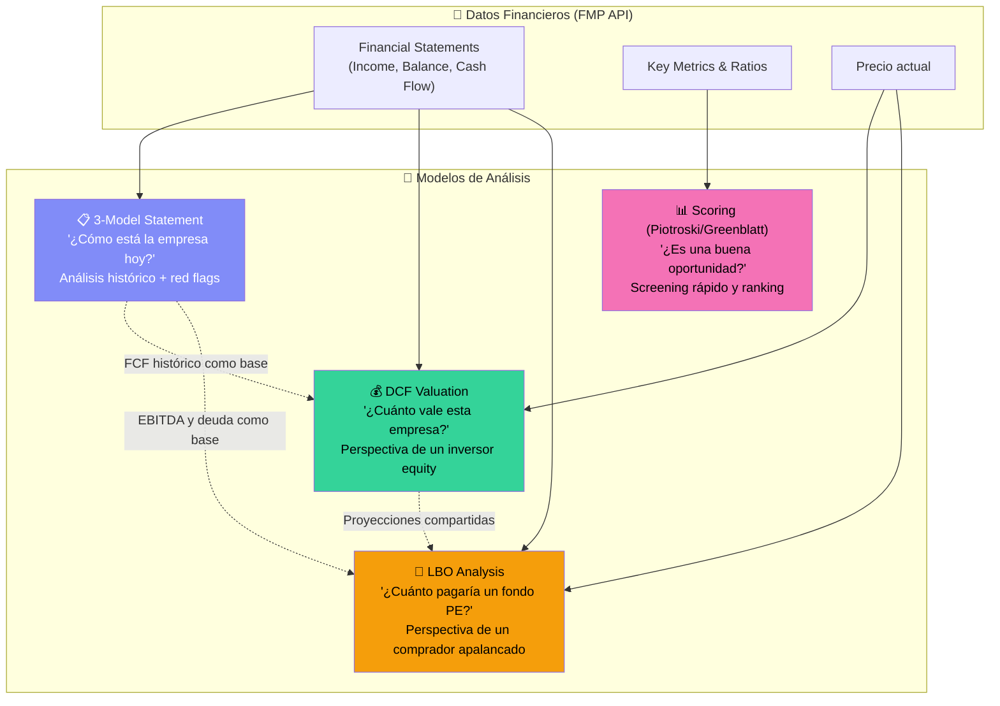
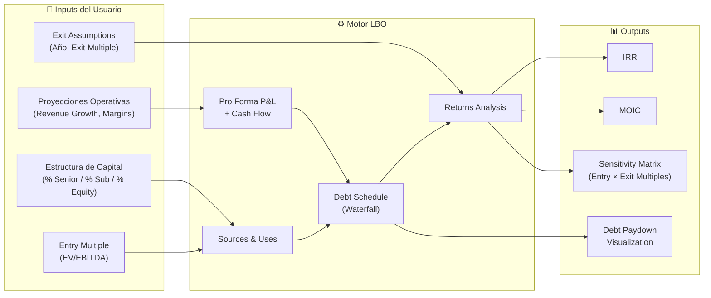
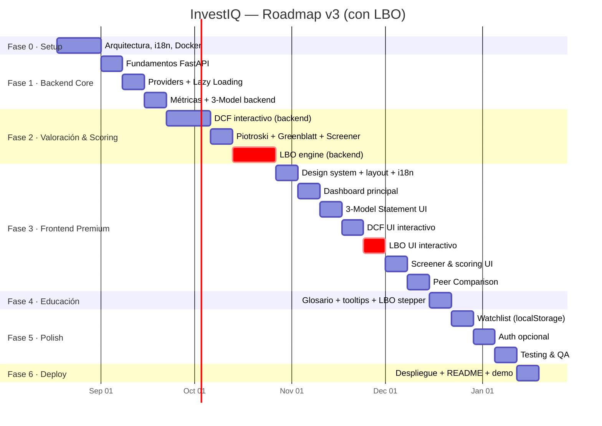
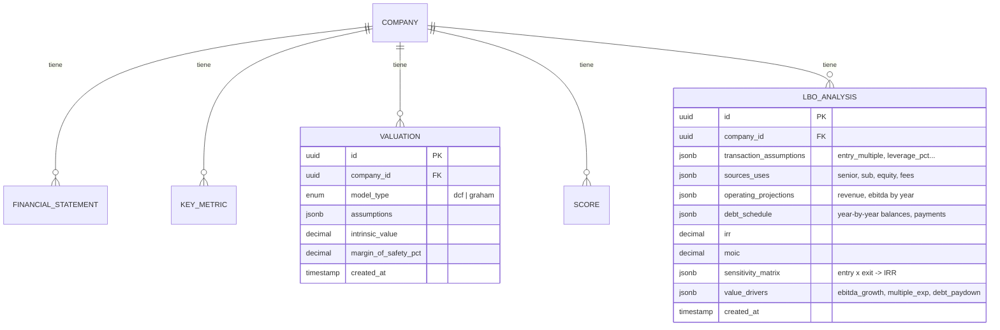

# 📊 InvestIQ — Roadmap v3 (con LBO Analysis)

---

## ¿Por qué SÍ incluir un modelo LBO?

Antes de actualizar el roadmap, mi análisis de la decisión:

### ✅ Razones a favor (pesan más)

| Razón | Impacto |
|:------|:--------|
| **El 3-Model Statement ya está construido** | Un LBO es, en esencia, un 3-statement model + un debt schedule + returns analysis. El 80% de la infraestructura ya existe |
| **Diferenciador brutal para CV** | Casi ningún proyecto de portfolio tiene un LBO interactivo. Para roles de IB y PE, es *la* prueba de fuego |
| **Complementa al DCF perfectamente** | DCF responde "¿cuánto vale esta empresa?" · LBO responde "¿cuánto pagaría un fondo de PE por ella?" — dos perspectivas del mismo activo |
| **Reutiliza las proyecciones del DCF** | El operating model (revenue, EBITDA, FCF proyectados) ya lo tenemos del motor DCF |
| **Componente educativo potente** | Los conceptos LBO (apalancamiento, IRR, MOIC, debt waterfall) son fascinantes de visualizar y muy difíciles de entender solo en Excel |

### ⚠️ Riesgos (mitigados)

| Riesgo | Mitigación |
|:-------|:-----------|
| "Un LBO no es Value Investing" | Cierto, pero el proyecto no es *solo* Value Investing — es una **plataforma de análisis financiero integral**. El LBO amplía el público objetivo (PE, IB) sin contradecir al resto |
| Complejidad excesiva | Implementamos un **LBO simplificado** con 2 tramos de deuda (Senior + Sub), no 6 tramos con PIK, warrants y mezz. Suficiente para impresionar sin volver el proyecto inmanejable |
| Datos que no vienen de la API | Los inputs del LBO son supuestos del usuario (entry multiple, leverage, exit year). Esto es igual que el DCF — la API proporciona los financials históricos, el usuario define el escenario |

### 📐 Cómo encajan los 4 modelos juntos



> [!IMPORTANT]
> El flujo natural del usuario sería: **Screener** (filtrar candidatas) → **3-Model Statement** (diagnosticar salud) → **DCF** (valorar como inversor) → **LBO** (valorar como PE). Cada modelo alimenta al siguiente.

---

## 1. Modelo LBO — Diseño Técnico

### Componentes del LBO Simplificado



### 5 Módulos del LBO

#### Módulo 1: Sources & Uses

| **Sources** (De dónde viene el dinero) | **Uses** (A dónde va) |
|:---------------------------------------|:----------------------|
| Senior Debt (Term Loan) | Purchase Price (Entry Multiple × EBITDA) |
| Subordinated Debt | Refinancing of Existing Debt |
| Sponsor Equity | Transaction Fees (~2-3%) |
| | Cash to Balance Sheet |
| **Total Sources** | **Total Uses** |

#### Módulo 2: Operating Projections (5 años)

Reutiliza el motor de proyecciones del DCF:
- Revenue Growth (%) → Revenue
- EBITDA Margin (%) → EBITDA
- CapEx (% of Revenue) → Free Cash Flow
- Working Capital changes

#### Módulo 3: Debt Schedule (Waterfall)

2 tramos simplificados (suficiente para el 90% de los conceptos):

| Tramo | Características |
|:------|:---------------|
| **Senior Debt** | Amortización obligatoria (ej: 5% anual) + cash sweep con FCF restante. Interés fijo (ej: 5-7%) |
| **Subordinated Debt** | Sin amortización obligatoria (bullet al vencimiento). Interés más alto (ej: 8-12%) |

**Cash Flow Waterfall (orden de prioridad):**
```
Free Cash Flow disponible
  └─ 1. Interés Senior Debt
     └─ 2. Interés Sub Debt  
        └─ 3. Amortización obligatoria Senior
           └─ 4. Cash Sweep → pagar Senior adicional
              └─ 5. Excedente → se acumula como cash
```

#### Módulo 4: Returns Analysis

```
Exit Enterprise Value = Exit EBITDA × Exit Multiple
  − Deuda remanente (Senior + Sub pendiente)
  + Cash acumulado
  ─────────────────────────────
  = Exit Equity Value

MOIC = Exit Equity / Initial Equity
IRR  = solve for r: Initial Equity × (1+r)^n = Exit Equity
```

#### Módulo 5: Sensitivity Analysis

Matriz bidimensional de IRR:

|  | Exit Multiple 6× | 7× | 8× | 9× | 10× |
|:--|:--|:--|:--|:--|:--|
| **Entry 6×** | 18% | 23% | 28% | 32% | 36% |
| **Entry 7×** | 12% | 17% | 21% | 25% | 29% |
| **Entry 8×** | 7% | 12% | 16% | 20% | 23% |
| **Entry 9×** | 3% | 8% | 12% | 15% | 19% |

*(coloreada como heatmap: verde >20%, amarillo 15-20%, rojo <15%)*

---

## 2. Stack Tecnológico (Sin cambios respecto a v2)

| Capa | Tecnología |
|:---|:---|
| **Frontend** | React 18+ / TypeScript / Vite |
| **UI Kit** | Shadcn/UI + Radix |
| **Gráficos** | Recharts + Lightweight Charts |
| **i18n** | react-i18next + Intl API |
| **Estado** | TanStack Query |
| **Backend** | FastAPI (Python 3.11+) |
| **ORM** | SQLAlchemy 2.0 async + Alembic |
| **Task Queue** | Celery + Redis broker |
| **BD** | PostgreSQL (Neon free) |
| **Caché** | Redis (Upstash free) |
| **Testing** | pytest + RTL + Playwright |
| **CI/CD** | GitHub Actions |
| **Hosting** | Vercel (frontend) + Render (backend) |
| **Coste total** | **$0.00/mes** |

---

## 3. Fases de Desarrollo (Sprints)

### Fase 0 — Diseño y Arquitectura (Semana 1-2)

| Tarea | Entregable |
|:---|:---|
| Diseñar la arquitectura completa | Diagrama C4 en el README |
| Diseñar el esquema de BD (incluye tablas LBO) | Migraciones Alembic iniciales |
| Configurar monorepo | `/backend` + `/frontend` |
| Docker Compose | postgres, redis, backend, frontend, celery-worker |
| Setup i18n base | Estructura de locales, config react-i18next |
| Wireframes UI (incluye LBO) | Mockups |
| CI/CD | GitHub Actions: lint + test en cada PR |
| README profesional | Elevator pitch, diagrama, badges |

**Estructura del repositorio:**
```
investiq/
├── backend/
│   ├── app/
│   │   ├── api/v1/
│   │   ├── core/
│   │   ├── models/
│   │   ├── schemas/
│   │   ├── services/
│   │   │   ├── providers/       # FMP, AlphaVantage (Strategy pattern)
│   │   │   ├── valuation/
│   │   │   │   ├── dcf.py       # DCF engine
│   │   │   │   └── lbo.py       # 🆕 LBO engine
│   │   │   ├── scoring/         # Piotroski, Greenblatt
│   │   │   ├── metrics/         # ROIC, WACC, ratios
│   │   │   └── statements/      # 3-Model Statement
│   │   ├── workers/
│   │   └── db/
│   ├── tests/
│   │   ├── unit/
│   │   │   ├── test_dcf.py
│   │   │   ├── test_lbo.py      # 🆕
│   │   │   └── ...
│   │   ├── integration/
│   │   └── fixtures/
│   ├── alembic/
│   └── Dockerfile
├── frontend/
│   ├── public/locales/
│   │   ├── es/
│   │   │   ├── common.json
│   │   │   ├── finance.json
│   │   │   ├── valuation.json
│   │   │   ├── lbo.json         # 🆕
│   │   │   └── glossary.json
│   │   └── en/
│   │       └── ...
│   ├── src/
│   │   ├── features/
│   │   │   ├── dashboard/
│   │   │   ├── statements/
│   │   │   ├── valuation/       # DCF UI
│   │   │   ├── lbo/             # 🆕 LBO UI
│   │   │   ├── screener/
│   │   │   ├── comparison/
│   │   │   └── learn/
│   │   └── ...
│   └── Dockerfile
├── docker-compose.yml
└── ...
```

---

### Fase 1 — Backend Core & Ingesta de Datos (Semana 3-5)

*(Sin cambios respecto a v2)*

**Sprint 1.1 — Fundamentos del Backend (Semana 3)**
- [ ] Setup FastAPI, SQLAlchemy async, Alembic, Neon, Upstash Redis
- [ ] Modelos: `Company`, `FinancialStatement`, `KeyMetric`, `CompanyUniverse`
- [ ] Health check, middleware (CORS, rate limiting, error handling)

**Sprint 1.2 — Sistema de Providers & Ingesta (Semana 4)**
- [ ] `DataProvider` interface → `FMPProvider` + `AlphaVantageProvider`
- [ ] `QuotaManager` (tracking calls/día)
- [ ] Lazy loading: búsqueda → fetch → cache → respuesta
- [ ] Celery tasks: `sync_company()`, `batch_update()`
- [ ] Rate limiting, retries, circuit breaker

**Sprint 1.3 — Motor de Métricas & 3-Model Backend (Semana 5)**
- [ ] `MetricsCalculator` — 30+ KPIs (rentabilidad, solvencia, valoración, eficiencia, crecimiento)
- [ ] `ThreeStatementModel` — conexiones entre partidas, Δ% YoY, red flags
- [ ] Endpoints: `/metrics`, `/statements`, `/three-model`
- [ ] Caché Redis con TTLs diferenciados
- [ ] Tests con fixtures congelados

---

### Fase 2 — Motores de Valoración & Scoring (Semana 6-10)

**Sprint 2.1 — DCF Interactivo (Semana 6-7)**

- [ ] Servicio `DCFValuation`:
  - Proyección FCF (3 métodos: histórico, estimado, manual)
  - WACC vía CAPM: $R_e = R_f + \beta \times ERP$
  - Terminal Value: $TV = \frac{FCF_n \times (1+g)}{WACC - g}$
  - Enterprise Value → Equity Value → Intrinsic Value/Share
  - Margin of Safety
- [ ] Análisis de sensibilidad: matriz WACC × Terminal Growth
- [ ] Escenarios: Conservador / Base / Optimista
- [ ] Endpoints: `POST /valuations/dcf`, `GET /valuations/dcf/{ticker}/auto`
- [ ] Tests contra valoraciones DCF verificadas

**Sprint 2.2 — Modelos de Scoring (Semana 8)**

- [ ] `PiotroskiFScore` — 9 señales binarias (score 0-9)
- [ ] `GreenblattMagicFormula` — Earnings Yield + ROIC ranking
- [ ] `Screener` — filtros multi-criterio, paginación cursor-based
- [ ] Endpoints: `/scores/{ticker}/piotroski`, `/scores/{ticker}/greenblatt`, `/screener`

**Sprint 2.3 — 🆕 Motor LBO (Semana 9-10)**

- [ ] Servicio `LBOModel`:

  ```python
  class LBOModel:
      """
      Simplified LBO with 2 debt tranches.
      Reuses DCF projection engine for operating model.
      """
      def sources_and_uses(self, assumptions: LBOAssumptions) -> SourcesUses
      def build_debt_schedule(self, projections, debt_structure) -> DebtSchedule
      def calculate_returns(self, exit_assumptions) -> LBOReturns
      def sensitivity_matrix(self, entry_range, exit_range) -> SensitivityGrid
  ```

- [ ] **Sources & Uses**: Dado entry multiple × LTM EBITDA → calcular purchase price, debt splits, equity check
- [ ] **Operating Model**: Reutilizar `ProjectionEngine` del DCF (Revenue Growth, EBITDA Margin, CapEx, NWC)
- [ ] **Debt Schedule** con cash flow waterfall:
  1. Interest payments (Senior → Sub)
  2. Mandatory amortization (Senior only)
  3. Cash sweep (FCF remanente → Senior prepayment)
  4. Revolver draw/repay si FCF negativo
- [ ] **Returns**: IRR (solver con `scipy.optimize.brentq`) + MOIC
- [ ] **Sensitivity**: Matriz Entry Multiple × Exit Multiple → IRR en cada celda
- [ ] Modelo `LBOAnalysis` en BD:

  ```python
  class LBOAnalysis(Base):
      id:              UUID
      company_id:      FK → Company
      assumptions:     JSONB  # entry_multiple, leverage, rates...
      sources_uses:    JSONB
      debt_schedule:   JSONB  # year-by-year breakdown
      irr:             Decimal
      moic:            Decimal
      sensitivity:     JSONB  # matrix
      created_at:      Timestamp
  ```

- [ ] Endpoints:
  - `POST /api/v1/valuations/lbo` — calcular LBO con supuestos custom
  - `GET /api/v1/valuations/lbo/{ticker}/auto` — supuestos por defecto basados en financials reales
  - `GET /api/v1/valuations/lbo/{ticker}/sensitivity` — matriz de sensibilidad
- [ ] **Validaciones**:
  - DSCR (Debt Service Coverage Ratio) < 1.0 → Warning "La empresa no genera suficiente cash flow para cubrir la deuda"
  - Leverage > 8× EBITDA → Warning "Apalancamiento excesivo"
  - IRR negativo → Flag "Destrucción de valor"
- [ ] Tests:
  - Test con empresa conocida (ej: mock de DELL LBO 2013)
  - Test de edge cases (FCF negativo, exit antes de paydown completo)
  - Verificar IRR contra cálculo manual

---

### Fase 3 — Frontend & UX Premium (Semana 11-17)

**Sprint 3.1 — Design System, Layout & i18n (Semana 11)**

- [ ] Setup Vite + React + TypeScript + react-i18next
- [ ] Design system: tokens, dark mode, CSS variables
- [ ] Componentes base: Card, Badge, Tooltip, DataTable, Skeleton, LanguageSwitcher
- [ ] Layout: sidebar + topbar + content
- [ ] API client + TanStack Query
- [ ] Archivos i18n iniciales (incluyendo `lbo.json` en ES y EN)

**Sprint 3.2 — Dashboard Principal (Semana 12)**

- [ ] Búsqueda con autocompletado
- [ ] Vista de empresa con tabs: `Resumen` | `Financials` | `Valoración` | `LBO` | `Scoring`
- [ ] Tab Resumen: KPIs (semáforo 🟢🟡🔴), precio, radar de salud financiera
- [ ] Tooltips educativos en cada KPI

**Sprint 3.3 — 3-Model Statement UI (Semana 13)**

- [ ] Vista enlazada 3 estados financieros (side-by-side desktop, tabs mobile)
- [ ] Highlighting de conexiones (hover → resalta partidas relacionadas)
- [ ] Toggle anual/trimestral, tendencias ↑↓, red flags ⚠️
- [ ] Exportar CSV, tooltips educativos por partida

**Sprint 3.4 — DCF Interactivo UI (Semana 14)**

- [ ] Formulario de supuestos (sliders + inputs + presets)
- [ ] Tabla de proyección, gauge de valor intrínseco
- [ ] Heatmap de sensibilidad (WACC × Growth)
- [ ] Stepper educativo paso-a-paso

**Sprint 3.5 — 🆕 LBO Interactivo UI (Semana 15)**

> [!IMPORTANT]
> Esta es la pantalla que más impresionará a reclutadores de IB y PE. Debe ser visualmente espectacular y pedagógicamente clara.

- [ ] **Panel de Supuestos** (sidebar o panel superior colapsable):

  | Input | Control UI | Default |
  |:------|:-----------|:--------|
  | Entry Multiple (EV/EBITDA) | Slider 4×–15× | LTM EV/EBITDA de la empresa |
  | Senior Debt (% del EV) | Slider 0–70% | 40% |
  | Sub Debt (% del EV) | Slider 0–30% | 20% |
  | Equity (auto-calculado) | Display (100% - Senior - Sub) | 40% |
  | Senior Interest Rate | Input % | 6.0% |
  | Sub Interest Rate | Input % | 10.0% |
  | Senior Amortization | Input %/año | 5.0% |
  | Revenue Growth | Slider -5% a +20% | Media histórica |
  | EBITDA Margin | Slider 5%–50% | Media histórica |
  | Exit Year | Selector 3–7 años | 5 |
  | Exit Multiple | Slider 4×–15× | = Entry Multiple |

- [ ] **Visualización Sources & Uses**:
  - Waterfall chart (barras apiladas): Sources a la izquierda, Uses a la derecha
  - Colores diferenciados: Senior (azul), Sub (naranja), Equity (verde), Fees (gris)

- [ ] **Visualización Debt Schedule**:
  - Stacked area chart: evolución de cada tramo de deuda año a año
  - Línea de EBITDA superpuesta para ver el desapalancamiento relativo
  - Tabla detallada debajo (expandible):

    ```
    Año     | EBITDA | FCF  | Int. Senior | Int. Sub | Amort. | Sweep | Senior Bal | Sub Bal | Total Debt | Leverage
    --------|--------|------|-------------|----------|--------|-------|------------|---------|------------|--------
    Entry   |   100  |  —   |     —       |    —     |   —    |   —   |    400     |   200   |    600     |  6.0×
    Year 1  |   110  |  55  |    24.0     |   20.0   |  20.0  |  11.0 |    369     |   200   |    569     |  5.2×
    Year 2  |   121  |  63  |    22.1     |   20.0   |  20.0  |  20.9 |    328     |   200   |    528     |  4.4×
    ...     |  ...   | ...  |    ...      |   ...    |  ...   |  ...  |    ...     |   ...   |    ...     |  ...
    ```

- [ ] **Visualización Returns**:
  - Tarjetas grandes: **IRR** (%) y **MOIC** (×) con indicador de color
    - IRR ≥ 25%: 🟢 "Excelente" | 20-25%: 🟢 "Bueno" | 15-20%: 🟡 "Aceptable" | <15%: 🔴 "Insuficiente"
    - MOIC ≥ 3.0×: 🟢 | 2.0-3.0×: 🟡 | <2.0×: 🔴
  - **Waterfall de creación de valor**: barra que descompone el retorno en sus 3 drivers:
    1. 📈 EBITDA Growth (crecimiento operativo)
    2. 📊 Multiple Expansion/Contraction (entry vs exit multiple)
    3. 🏦 Debt Paydown (desapalancamiento)

- [ ] **Heatmap de Sensibilidad** (Entry × Exit Multiples → IRR):
  - Gradiente de color: rojo → amarillo → verde
  - Hover muestra MOIC + IRR de cada celda
  - Línea de "target IRR" (ej: 20%) como contorno

- [ ] **Stepper Educativo LBO** (modo aprendizaje ON):

  ```
  Paso 1/6: ¿Qué es un LBO?
  ─────────────────────────────
  Un Leveraged Buyout es la adquisición de una empresa usando
  una combinación de deuda y equity. El objetivo es usar los
  flujos de caja de la empresa para pagar la deuda, y al vender
  la empresa años después, quedarse con un retorno amplificado
  por el apalancamiento.

  📐 Piensa en ello como comprar una casa con hipoteca:
  pones el 20%, el banco pone el 80%, y si la casa sube de
  valor, tu retorno sobre ese 20% es mucho mayor que si
  hubieras pagado todo en cash.

  [→ Siguiente: Sources & Uses]
  ```

  Pasos: ¿Qué es un LBO? → Sources & Uses → El Debt Schedule → Cash Sweep → Exit & Returns → IRR vs MOIC

- [ ] **Tooltip de cada campo** con:
  - Definición del concepto
  - Rango típico en el mercado (ej: "Entry multiples de PE suelen estar entre 6-12× EBITDA")
  - Impacto: "↑ Entry Multiple → ↓ IRR" (con flecha direccional)

**Sprint 3.6 — Screener & Scoring UI (Semana 16)**

- [ ] Tabla del screener con filtros avanzados
- [ ] Tarjetas de scoring (Piotroski ✅/❌, Greenblatt ranking)
- [ ] Rankings globales, animaciones

**Sprint 3.7 — Peer Comparison (Semana 17)**

- [ ] Comparador de 2-3 empresas side-by-side
- [ ] Tabla comparativa de KPIs, gráficos superpuestos, radar chart comparativo
- [ ] Incluir comparación de métricas LBO-relevant (EV/EBITDA, FCF Yield, Leverage)

---

### Fase 4 — Educación Integrada & Glosario (Semana 18)

- [ ] Tooltips contextuales en toda la app (KPIs, DCF, LBO, Scoring)
- [ ] Página `/learn` — Glosario financiero interactivo:
  - Categorías: Rentabilidad, Solvencia, Valoración, Eficiencia, Cash Flow, **LBO & Private Equity** 🆕
  - Nuevos términos LBO: IRR, MOIC, Leverage, Cash Sweep, Debt Waterfall, DSCR, Entry/Exit Multiple, Sources & Uses, Sponsor Equity
  - Cada término: definición, fórmula LaTeX, ejemplo real, interpretación
- [ ] "Modo Aprendizaje" toggle (incluye steppers del DCF y del LBO)
- [ ] Todo el contenido educativo traducido ES/EN

---

### Fase 5 — Auth (Opcional), Polish & Testing (Semana 19-21)

**Sprint 5.1 — Watchlist & Persistencia Local (Semana 19)**
- [ ] Watchlist con localStorage
- [ ] Guardar último DCF y LBO configurado por empresa
- [ ] Exportar watchlist como JSON

**Sprint 5.2 — Autenticación Opcional (Semana 20)**
- [ ] JWT auth (registro, login)
- [ ] Migrar watchlist/valoraciones a BD si usuario se registra
- [ ] Historial de DCFs y LBOs guardados

**Sprint 5.3 — Testing & QA (Semana 21)**

- [ ] **Backend tests:**

  | Servicio | Tests |
  |:---------|:------|
  | `DCFValuation` | Verificar valor intrínseco contra cálculo manual (AAPL, MSFT) |
  | `LBOModel` | Verificar IRR/MOIC contra modelo Excel de referencia |
  | `LBOModel` | Edge cases: FCF negativo, exit temprano, leverage extremo |
  | `PiotroskiFScore` | Verificar score contra datos publicados |
  | `MetricsCalculator` | Verificar ratios contra datos de FMP |
  | `ThreeStatementModel` | Verificar conexiones y red flags |
  | `QuotaManager` | Verificar rate limiting y fallback |

- [ ] **Frontend tests:**
  - Component tests (React Testing Library)
  - i18n: verificar que todos los keys existen en ES y EN
  - E2E (Playwright):
    - Flujo: Buscar → Financials → DCF → resultado
    - Flujo: Buscar → LBO → ajustar supuestos → ver IRR/sensitivity
    - Flujo: Cambiar idioma → verificar toda la UI
    - Flujo: Screener → filtrar → scoring
- [ ] Coverage >80%, Lighthouse >90, API <200ms

---

### Fase 6 — Despliegue & Documentación (Semana 22)

- [ ] Dockerización completa
- [ ] Deploy: Vercel (frontend) + Render (backend) + Neon (PG) + Upstash (Redis)
- [ ] Keep-alive cron via GitHub Actions
- [ ] README definitivo con screenshots del DCF *y del LBO*
- [ ] Video demo (3 min) mostrando el flujo completo
- [ ] OpenAPI spec exportada

---

## 4. Cronograma Visual



**Duración total: ~22 semanas** (+2 semanas respecto a v2 por el LBO backend + frontend)

---

## 5. Modelo de BD Actualizado (Solo cambios)



> [!TIP]
> El LBO tiene su propia tabla en lugar de compartir `VALUATION` porque la estructura de datos es fundamentalmente diferente (deuda, schedule, múltiples de entrada/salida). Esto mantiene los schemas limpios.

---

## 6. Recomendaciones para el CV & GitHub (Actualizado)

### Carpetas/Archivos que Impresionan

| Elemento | Impacto | Target |
|:---------|:--------|:-------|
| `services/valuation/dcf.py` | Lógica financiera completa (WACC, FCFF, Terminal Value) | Todos |
| `services/valuation/lbo.py` | 🆕 Debt waterfall, IRR solver, sensitivity | **IB / PE** |
| `services/scoring/piotroski.py` | Paper académico → código | Asset Management |
| `services/statements/three_model.py` | Conocimiento contable profundo | **IB / Audit** |
| `services/providers/base.py` | Strategy pattern, SOLID | Engineering |
| `tests/unit/test_lbo.py` | 🆕 Tests rigurosos con datos verificados | Todos |
| `frontend/src/features/lbo/` | 🆕 Visualización financiera compleja | **Todos** |

### Bullets para el CV (Actualizados)

**Para roles de Private Equity / M&A:**
```
• Developed an interactive LBO analysis module with 2-tranche debt schedule,
  cash flow waterfall, and IRR/MOIC computation (scipy solver), including
  entry/exit multiple sensitivity matrices visualized as interactive heatmaps.
```

**Para roles de Investment Banking:**
```
• Built a full-stack financial modeling platform featuring DCF valuation,
  LBO analysis, and linked 3-Statement Model with cross-statement highlighting,
  demonstrating proficiency in deal-level financial modeling and analysis.
```

**Para roles de Fintech / Engineering:**
```
• Architected a multilingual (ES/EN) financial analysis platform processing
  30+ KPIs per company, with 3-tier caching (React Query → Redis → PostgreSQL),
  async data pipelines (Celery), and <200ms response times — deployed at $0/month.
```

### Keywords Actualizados por Sector

| Sector | Keywords |
|:-------|:---------|
| **Private Equity** | LBO modeling, IRR, MOIC, debt schedule, cash sweep, leverage analysis, entry/exit multiples |
| **Banca de Inversión** | DCF, WACC, CAPM, 3-statement model, LBO, financial modeling, sensitivity analysis |
| **Asset Management** | Piotroski F-Score, Greenblatt, screening, ROIC, factor investing |
| **Fintech / Engineering** | API design, async pipelines, caching, i18n, CI/CD, Docker, TypeScript |

---

## 7. Resumen de Cambios v2 → v3

| Elemento | v2 | v3 |
|:---------|:---|:---|
| Modelos de valoración | DCF | DCF + **LBO** |
| Sprints | 17 | 19 (+Sprint 2.3 LBO backend, +Sprint 3.5 LBO UI) |
| Duración total | ~20 semanas | **~22 semanas** |
| Tabla BD | `VALUATION` | `VALUATION` + `LBO_ANALYSIS` |
| Tabs empresa | Resumen, Financials, Valoración, Scoring | + **LBO** |
| Glosario | 5 categorías | 6 categorías (+LBO & Private Equity) |
| Namespaces i18n | 5 archivos | 6 archivos (+`lbo.json`) |
| CV keywords | 3 sectores | 4 sectores (+**Private Equity**) |
| Coste mensual | $0 | **$0** (sin cambio) |

> [!NOTE]
> Lo que **NO** incluí en el LBO (intencionalmente): PIK interest, mezzanine con warrants, management rollover, dividend recaps, bolt-on acquisitions. Estos son features avanzados que se podrían añadir como v2 del LBO si quisieras, pero el modelo de 2 tramos cubre el 90% de los conceptos y es lo que se pide en entrevistas de IB/PE.
